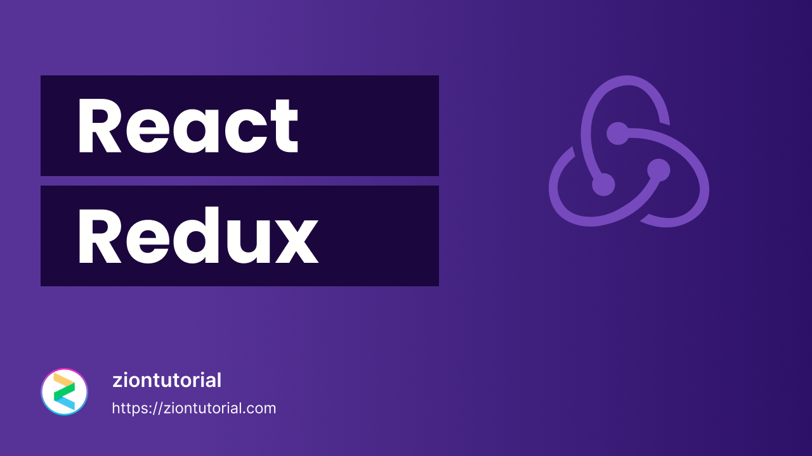

 
 

With [React Js Login ](https://dev.to/ziontutorial/core-concepts-of-redux-3ehk) React Redux | React Redux Tutorial | React Redux for beginners.

 
The app is developed using React.js.

 

## 💻 Live Demo:

[https://ziontutorial.com/](https://ziontutorial.com/how-to-create-responsive-login-form-using-only-react-js/)

 

## ✨ Getting Started

- Make sure you already have `Node.js` and `npm` installed in your system.

 

## ⚡ Install

- Clone the repository:
 

## 📙 Used libraries

- `react-js`

Check `packages.json` for details

 

 
Thank You ☺
